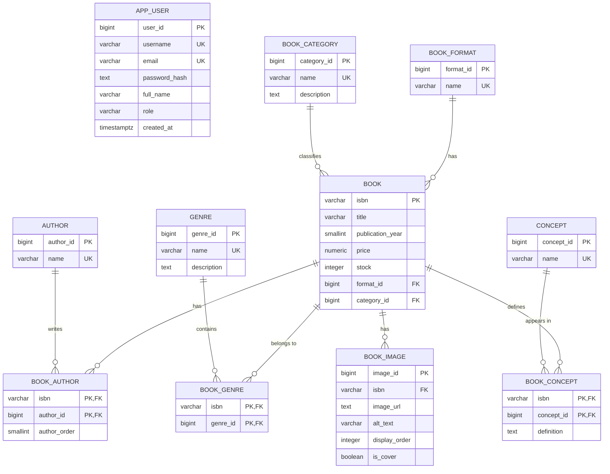

# Diagrama entidad-relación

## Restricciones principales

- `APP_USER` admite muchos clientes, pero el índice parcial `one_admin_only_idx` permite como máximo un usuario con rol `admin`.
- `BOOK_IMAGE` permite varias imágenes por libro y el índice parcial `one_cover_image_per_book_idx` permite como máximo una portada por libro.
- `BOOK_AUTHOR`, `BOOK_GENRE` y `BOOK_CONCEPT` resuelven las relaciones multivaluadas mediante claves primarias compuestas.
- `BOOK_CONCEPT` conserva una definición específica para cada combinación de libro y concepto.